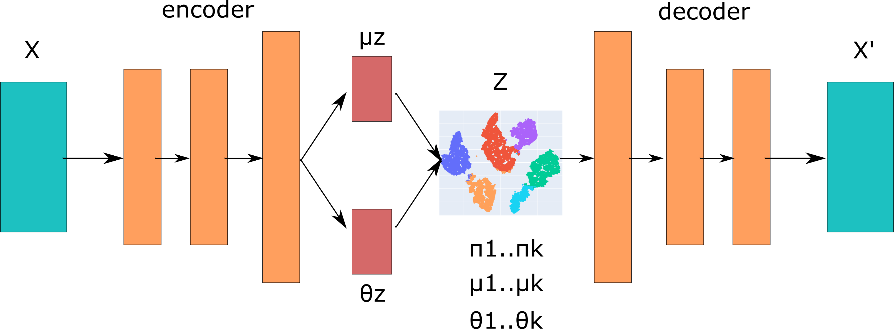

# LoopBin
LoopBin, an unsupervised neural network adapted from the variational deep embedding (VADE) model to cluster chromatin loops based on genome interaction and protein binding profiles. It learns the genomic features captured by micro-C and Cut&amp;Tag data in a latent space and separates the latent representations in a clustering model. By applying the framework to different comparison settings, we can quantify loop types and understand the dynamic shifting in response to changes in cellular context. 


## Authors
Yajie Zhu, Alexis Bel

## Installation
Clone the repo and install the dependencies:
```bash
git clone https://github.com/YajieZhu018/LoopBin
conda env create --file loopbin.yml
conda activate loopbin
```

## Data
This pipeline requires:
1. A .bedpe file containing the coordinate of loop anchors.
2. A .mcool file containing the micro-C interaction.
3. Several .bigwig files containing the protein binding profiles like CTCF, cohesin, H3K27ac and H3K27me3 captured by ChIP-seq or Cut&Tag techniques.
The data that we used to train the model can be downloaded from https://www.ncbi.nlm.nih.gov/geo/query/acc.cgi?acc=GSE178593.

## Implement
```bash
python main.py -f FUNCTION --arguements
```
⭐Step 1. Preprocessing bigwig
```bash
python main.py -f preprocess -b BIGWIG_FILE -g OUTPUT_FOLDER -n BIGWIG_NAME
```
-b: the bigwig file to be preprocessed into bedgraphs

-g: the output folder

-n: which protein binding profile is used, such as CTCF, H3K27ac, H3K27me3, or SMC1A


⭐Step 2. Processing input data
```bash
python main.py -f process -l LOOP_FILE -c COOL_FILE -g PROCESSED_DATA_FOLDER -r PROCESSOR -u OUTPUT_FOLDER
```
-l: the .bedpe file containing the coordinates of loop anchors

-c: the .mcool file

-g: the folder containing the bedgraph files from epigenetic features, output from the step 1

-r: the number of processors

-u: the output folder 

Normalize and merge input data from different conditions
```bash
python main.py -f normalize -e CONDITION1,CONDITION2,... -u OUTPUT_FOLDER
```
-e: conditions to merge. They are the names of the subfolder where we store the individual processed data

-u: the output folder


⭐Step 3. Pretrain the AE model
```bash
python main.py -f pretrain -d INPUT_DATA -u OUTPUT_FOLDER
```
-d: the processed input data

-u: the output folder


⭐Step 4. Train the VADE model
```bash
python main.py -f train -num NUMBER_CLUSTERS -d INPUT_DATA -if_pre True -pre PRETRAINED_MODEL -ep NUMBER_EPOCHS -u OUTPUT_FOLDER -p NAME1,NAME2,...
```
-num: the number of clusters, set by the users based on experiences and domain knowledges

-d: the processed input data

-if_pre: if used pretrained model. Set True by default

-pre: the pretrained AE model, output from the pretraining step

-ep: the number of epochs

-u: the output folder

-p: Names of the CUT&TAG separated by comma. The default is CTCF,H3K27ac,H3K27me3,SMC1A


⭐Step 5. Predict clusters
```bash
python main.py -f cluster -d INPUT_DATA -m MODEL -u OUTPUT_FOLDER
```
-d: the processed input data

-m: the trained model

-u: the output folder

⭐Step 6. Merge small clusters (optional)
If the model outputs undesirable small clusters, like which contains less than 2% of loops, you can choose to merge them with others. 
```bash
python main.py -f merge -k 2,3 -d INPUT_DATA -u $OUTPUT_FOLDER -p NAME1,NAME2,...,
```
-k: labels of the clusters to merge separated by comma such as 2,3

-d: the processed input data

-u: the output folder

-p: Names of the CUT&TAG separated by comma.


